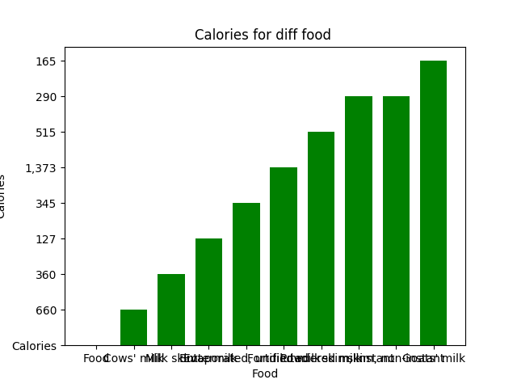
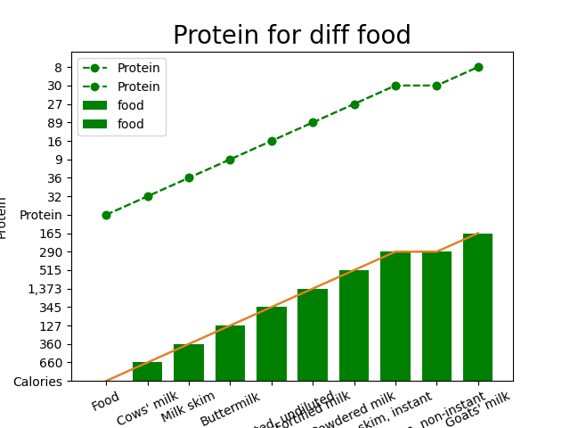

Nutritional Facts for most common foods
=======================================

Contents
========

* [Overview](#overview)
	* [Content](#content)
	* [Top 20 Food Vs Calories](#top-20-food-vs-calories)
	* [Top 20 Food Vs Protein](#top-20-food-vs-protein)

# Overview

Everybody nowadays is mindful of what they eat.Counting calories and reducing fat intake is the number one advice given 
by all dieticians and nutritionists.Therefore, we need to know what foods are rich in what nutrients, don't we?

## Content

this  analysis contains a data for the Top 20 foods in the world each with the amount of Calories,Fats, Proteins, 
Saturated Fats, Carbohydrates, Fibers labelled for each food. Also, the foods are also categorised into various groups 
like Desserts, Vegetables, Fruits etc.
## Top 20 Food Vs Calories

 check out this graphs show  the comparison  of the Calories for each of the food lidt   

## Top 20 Food Vs Protein

 check out this graphs show  the comparison  of the Protein for each of the food lidt   

